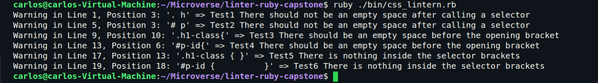

# CSS Lintern - Ruby Capstone Project
> In this project i managed to build a helper for the css files that are needed to give style to your website. It will read everyline of the css code to find basic typo warnings that we might do as begginers in the area.

## Built With
- Ruby

## How to run it
1. Download the project.
-Click on the green button that says "Code", on the upper right side of the project frame and select Download ZIP
2. Go to the directory where you downloaded the ZIP file and open it. Extract its contents to any directory you want in your system.
3. Copy or move your stylesheet file inside "/lib" folder with the name of style.css.
4. Open your system terminal in the same directory where you extract the files.
5. Run the program with ruby ./bin/css_lintern.rb
6. Enjoy

## Authors
**Carlos Ospina**
- GitHub: [@carloso0114](https://github.com/carloso0114)
- Twitter: [Carlos_Osp1](https://twitter.com/Carlos_Osp1)
- LinkedIn: [Carlos Ospina](https://www.linkedin.com/in/carlos-ospina-242b831a6/)

## Show your support
Give a star if you like this project!